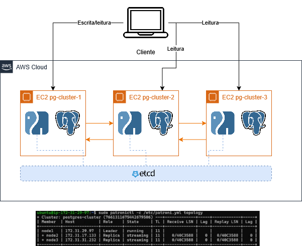
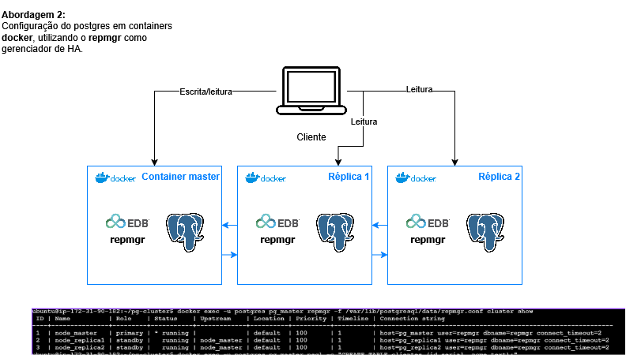

# Servidor de Banco de Dados Clusterizado (PostgreSQL HA) - Sistemas Operacionais
Repositório colaborativo para o desenvolvimento do projeto final da disciplina de Sistemas Operacionais.

> **Autores:**  
>    Gabriel Lima Dantas;  
>    João Pedro Sá;  
>    Leonardo Souza Silva;  
>    Nayla Sahra Santos das Chagas.

## Objetivo
 Configurar pelo menos três VMs Linux para suportar um banco de dados em alta disponibilidade. O grupo deve instalar o PostgreSQL, configurar a replicação física de dados (Master/Replica) e utilizar uma ferramenta como o Patroni ou repmgr para gerenciar o cluster e realizar o "failover" automático se o nó principal falhar.

## Metodologia

O desenvolvimento do trabalho se deu a partir do desenvolvimento de quatro etapas:

1. Utilização de abordagens distribuídas em bancos de dados
2. Estudo de caso e desenvolvimento de abordagens
3. Ferramentas, tutoriais e referências
4. Conclusão

## Utilização de abordagens distribuídas em bancos de dados

Por mais direcionados e detalhados sejam os cenários preditos por desenvolvedores, todo sistema apresenta falhas em algum momento do seu ciclo de vida. Geralmente o volume das falhas apresentadas aumenta de acordo com o crescimento no número de acessos ou da necessidade de recursos. Um dos problemas clássicos da área de sistemas operacionais aborda justamente as possíveis consequências do crescimento da demanda de acesso a um banco de dados: o problema dos leitores e escritores. Apesar das diversas aplicações de semáforos e threads em uma instância simples, o que permite um melhor gerenciamento do problema, sistemas de qualidade devem garantir performance, escalabilidade, usabilidade e confiabilidade.  
Uma das formas de implementar esses princípios é através da utilização de abordagens distribuídas. Um banco de dados distribuído é caracterizado pelo armazenamento de informação em mais de um ponto, chamados de nós ou instâncias, de forma a possibilitar o acesso às mesmas informações independente do ponto acessado. Assim, bancos de dados distribuídos oferecem escalabilidade horizontal, alta disponibilidade, tolerância a falhas e persistência de dados.

## Abordagens exploradas

Nesse projeto, exploramos três cenários de distribuição de bancos de dados, considerando suas ferramentas e facilidade de compreensão dos conceitos. Durante o desenvolvimento do projeto optamos por selecionar a abordagem de máquina virtual como abordagem principal para apresentação. Os conceitos utilizados no projeto convergem com os conteúdos da disciplina de forma mais clara e direta, além de possibilitar uma reprodução fiel pelo restante da turma caso desejado, já que descarta o uso ferramentas mais abstratas ou hardware específico.
O código de todas as abordagens pode ser encontrado em suas respectivas pastas, referenciadas em cada um dos tópicos a seguir.
## [Abordagem de máquina virtual](abordagem-maquina-virtual/README.md)
  
A arquitetura baseia-se na execução direta dos serviços sobre instâncias isoladas de computação em nuvem (AWS EC2) , eliminando camadas de virtualização de contêineres e estruturando a inteligência de tolerância a falhas através de um sistema de consenso distribuído.  

### Componentes Chave:
1. **Instâncias EC2 (Máquinas Virtuais):** Fornecem o ambiente computacional Linux isolado e independente para cada nó do cluster (pg-cluster-1, pg-cluster-2 e pg-cluster-3), simulando um cenário real de servidores físicos distribuídos.
2. **Patroni (Gerenciador de HA):** Atua acoplado a cada instância do PostgreSQL. Ele monitora o estado local do banco e se comunica com o sistema de consenso para decidir, de forma automatizada e dinâmica, qual nó assume a liderança e quais serão réplicas.
3. **etcd (Camada de Consenso):** Funciona como um repositório de chaves-valores distribuído e fortemente consistente. É o coração do algoritmo de eleição; os nós do Patroni mantêm uma trava (leader lock) ativa no etcd. Se o líder falhar, o bloqueio expira e o etcd coordena a promoção segura de uma das réplicas sem risco de split-brain.

### Dinâmica de Funcionamento (Escritas e Leituras)
A interação exige que a aplicação ou o cliente gerencie as conexões direcionando o tráfego de acordo com o papel de cada nó:

#### Fluxo de Escritas (Write)
1. A aplicação envia requisições de modificação de dados (INSERT, UPDATE, DELETE) especificamente para o endereço IP do nó eleito como líder (node1).
2. O Patroni valida o papel de escrita desse nó principal.
3. O nó líder processa a alteração e propaga os dados via replicação física de fluxo contínuo (Streaming Replication) para os nós secundários (node2 e node3).

#### Fluxo de Leituras (Read)

1. A aplicação direciona queries de consulta pura (SELECT) para qualquer um dos nós do cluster.
2. Para otimizar a performance e evitar gargalos no nó de escrita, as consultas de leitura são distribuídas diretamente para as instâncias configuradas como réplicas (pg-cluster-2 e pg-cluster-3) , que consomem os logs de replicação em tempo real.

## [Abordagem de contâiner docker](abordagem-docker/README.md)
  
A arquitetura baseia-se no empacotamento isolado dos serviços em contêineres Docker independentes rodando em um mesmo host , simplificando o deploy e utilizando o repmgr via comunicação direta em rede interna para gerenciar o ciclo de vida do cluster.

### Componentes Chave:

1. **Containers Docker:** Fornecem ambientes isolados de sistema de arquivos e processos para o nó mestre e suas réplicas, abstraindo a necessidade de provisionar múltiplos sistemas operacionais completos (VMs).
2. **PostgreSQL + repmgr (Camada de Dados):** Cada contêiner executa uma instância do PostgreSQL integrada ao repmgr. O repmgr monitora a saúde das instâncias através de checagens ativas de conectividade (ping) entre os contêineres.
3. **Mapeamento de Portas/Rede Bridge:** Conecta os contêineres através de uma rede virtual privada interna do Docker, permitindo que as réplicas localizem o contêiner master pelo nome de host atribuído.

### Dinâmica de Funcionamento (Escritas e Leituras)
O roteamento depende de definições estáticas na string de conexão do cliente:
#### Fluxo de Escritas (Write)
1. A aplicação se conecta obrigatoriamente ao contêiner rodando sob o papel de primary (node_master).
2. O PostgreSQL mestre recebe e processa localmente as transações de escrita.As modificações de dados são enviadas de forma assíncrona para as instâncias de réplica através do protocolo nativo do Postgres.

#### Fluxo de Leituras (Read)
1. A aplicação envia comandos SELECT mapeando os pontos de acesso específicos das réplicas.
2. As consultas de leitura são processadas de forma distribuída pelos contêineres node_replica1 e node_replica2 , aliviando o consumo de I/O do contêiner principal.  

## [Abordagem de contâiner kubernetes](abordagem-kubernetes/README.md)
  
A arquitetura baseia-se na separação estrita de responsabilidades entre **roteamento e inteligência de consultas** (camada de proxy) e **armazenamento persistente e replicação** (camada de dados).

### Componentes Chave:

1. **Kubernetes Cluster (Kind):** Fornece a infraestrutura em containers simulando um ambiente multi-nó real (1 Control-Plane e 2 Workers).
2. **Pgpool-II (Camada de Roteamento):** Implantado como um `Deployment`. Funciona como o único ponto de entrada para a aplicação. Analisa as queries SQL para separar escritas de leituras e balancear a carga.
3. **PostgreSQL + repmgr (Camada de Dados):** Implantado como um `StatefulSet` com volumes persistentes para garantir a identidade estável de cada nó (ex: `pod-0`, `pod-1`). O `repmgr` gerencia a saúde local e automatiza o *failover* eleger um novo líder se o principal falhar.

### Dinâmica de Funcionamento (Escritas e Leituras)

Toda a interação é feita apontando para o Service do Pgpool-II (porta `5432`). O comportamento interno opera sob as seguintes regras fundamentais:

#### Fluxo de Escritas (Write)

1. A aplicação envia comandos do tipo `INSERT`, `UPDATE`, `DELETE` ou abre blocos de transação estruturados (`BEGIN ... COMMIT`) para o Pgpool-II.
2. O Pgpool-II intercepta o comando e identifica que ele altera o estado do banco.
3. A operação é **direcionada exclusivamente para o Pod Primário** (`my-postgres-ha-postgresql-ha-postgresql-0`).

4. O nó primário grava o dado e propaga assincronamente as alterações geradas nos arquivos de log (*Write-Ahead Logging - WAL*) para os nós secundários via streaming replication assistido pelo `repmgr`.

#### Fluxo de Leituras (Read)

1. A aplicação executa uma query de consulta pura (`SELECT`).
2. O Pgpool-II analisa o comando e constata que ele é seguro para leitura paralela.
3. Aplicando algoritmos internos de balanceamento de carga, ele envia a query para **qualquer um dos Pods disponíveis no pool** (`pod-0`, `pod-1` ou `pod-2`), distribuindo a carga de CPU e I/O de maneira uniforme e otimizando o uso das réplicas.

## Ferramentas, tutoriais utilizados e referências
- [PostgreSQL](https://www.postgresql.org/docs/)
- [Patroni](https://patroni.readthedocs.io/en/latest/)
- [Repmgr](https://github.com/EnterpriseDB/repmgr)
- [PGPool-ii](https://www.pgpool.net/documentation/)
- [Bitnami](https://charts.bitnami.com/)
- [Helm](https://helm.sh/pt/docs/)
- [Docker](https://docs.docker.com/)
- [Kubernetes](https://kubernetes.io/pt-br/docs/home/)
- [Kubectl](https://kubernetes.io/pt-br/docs/tasks/tools/install-kubectl-linux/)
- [Kind](https://kind.sigs.k8s.io/docs/user/quick-start/#creating-a-cluster)
- [Helm for Data Engineers: A Beginner’s Guide Using kind and PostgreSQL](https://medium.com/@khoramism/helm-for-data-engineers-a-beginners-guide-using-kind-and-postgresql-5528fe993fbb)
- [Postgres-ha](https://artifacthub.io/packages/helm/bitnami/postgresql-ha)
- [How to implement repmgr for PostgreSQL automatic failover](https://www.enterprisedb.com/postgres-tutorials/how-implement-repmgr-postgresql-automatic-failover)  
- [PostgreSQL High Availability and automatic failover using repmgr](https://medium.com/@joao_o/postgresql-high-availability-and-automatic-failover-using-repmgr-5f505dc6913a)

## Conclusão

O desenvolvimento deste projeto permitiu consolidar de forma prática conceitos fundamentais abordados na disciplina de Sistemas Operacionais, transportando teorias de concorrência, comunicação interprocessos e gerenciamento de recursos para o cenário real de sistemas de arquivos distribuídos.  
A resolução prática do clássico problema dos leitores e escritores foi evidenciada na transição entre as abordagens: enquanto os modelos em Máquinas Virtuais (Patroni) e Containers puros (Docker) demonstraram a eficácia da replicação física para tolerância a falhas, a infraestrutura sob Kubernetes e Pgpool-II solidificou conceitos de abstração de rede, escalabilidade horizontal e exclusão mútua na arbitragem de concorrência. Conclui-se que o entendimento dessas camadas arquiteturais é indispensável para o desenvolvimento de sistemas modernos confiáveis, provando que os mecanismos básicos de sincronização e gerenciamento de processos do sistema operacional continuam sendo os pilares que sustentam as soluções de alta disponibilidade em nuvem.