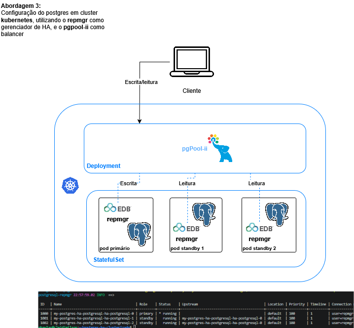

# PostgreSQL HA no Kubernetes com Repmgr e Pgpool-II

Esta documentação descreve a implantação, topologia e fluxo de dados de um cluster PostgreSQL de Alta Disponibilidade (HA) em ambiente Kubernetes Local (Kind) utilizando o pacote Helm Chart da Bitnami.

---

## 1. Visão geral da arquitetura

A arquitetura baseia-se na separação estrita de responsabilidades entre **roteamento e inteligência de consultas** (camada de proxy) e **armazenamento persistente e replicação** (camada de dados).



### Componentes Chave:

1. **Kubernetes Cluster (Kind):** Fornece a infraestrutura em containers simulando um ambiente multi-nó real (1 Control-Plane e 2 Workers).
2. **Pgpool-II (Camada de Roteamento):** Implantado como um `Deployment`. Funciona como o único ponto de entrada para a aplicação. Analisa as queries SQL para separar escritas de leituras e balancear a carga.
3. **PostgreSQL + repmgr (Camada de Dados):** Implantado como um `StatefulSet` com volumes persistentes para garantir a identidade estável de cada nó (ex: `pod-0`, `pod-1`). O `repmgr` gerencia a saúde local e automatiza o *failover* eleger um novo líder se o principal falhar.

---

## 2. Configurações de Infraestrutura e Implantação

### 2.1. Cluster Kubernetes (Kind)

O arquivo `kind-config.yaml` configura um cluster Kubernetes local composto por três nós Docker, simulando zonas de disponibilidade independentes:

```yaml
kind: Cluster
apiVersion: kind.x-k8s.io/v1alpha4
nodes:
- role: control-plane
- role: worker
- role: worker

```

### 2.2. Parâmetros do Cluster PostgreSQL (`values.yaml`)

O Helm da Bitnami consome as diretrizes de segurança, persistência e versões de imagem através das seguintes definições de propriedades:

* **Persistência:** Ativada com modo `ReadWriteOnce`, garantindo que cada réplica possua seu próprio disco virtualizado independente.
* **Contêineres de Dados:** Utiliza PostgreSQL 17 gerenciado pelo pacote legado de repmgr da Bitnami.
* **Contêineres de Proxy:** Utiliza Pgpool-II 4.6.3.
* **Contagem de Réplicas (Standbys):** Definido como `2`. Somando ao nó primário padrão, totaliza-se um cluster de **3 Pods de banco de dados**.

---

## 3. Dinâmica de Funcionamento (Escritas e Leituras)

Toda a interação é feita apontando para o Service do Pgpool-II (porta `5432`). O comportamento interno opera sob as seguintes regras fundamentais:

### Fluxo de Escritas (Write)

1. A aplicação envia comandos do tipo `INSERT`, `UPDATE`, `DELETE` ou abre blocos de transação estruturados (`BEGIN ... COMMIT`) para o Pgpool-II.
2. O Pgpool-II intercepta o comando e identifica que ele altera o estado do banco.
3. A operação é **direcionada exclusivamente para o Pod Primário** (`my-postgres-ha-postgresql-ha-postgresql-0`).


4. O nó primário grava o dado e propaga assincronamente as alterações geradas nos arquivos de log (*Write-Ahead Logging - WAL*) para os nós secundários via streaming replication assistido pelo `repmgr`.

### Fluxo de Leituras (Read)

1. A aplicação executa uma query de consulta pura (`SELECT`).
2. O Pgpool-II analisa o comando e constata que ele é seguro para leitura paralela.
3. Aplicando algoritmos internos de balanceamento de carga, ele envia a query para **qualquer um dos Pods disponíveis no pool** (`pod-0`, `pod-1` ou `pod-2`), distribuindo a carga de CPU e I/O de maneira uniforme e otimizando o uso das réplicas.

---

## 4. Guia de Operações e Administração (`Makefile`)

A automação e gerenciamento do ciclo de vida desse ecossistema são conduzidos pelos comandos mapeados no arquivo de automação (`Makefile`)
Considere que o ambiente testado foi um sistema Ubuntu 22.04.5 LTS, virtualizado em WSL:

### 4.1. Inicialização do Ambiente

Prepara as dependências do host (Kubectl, Helm), provisiona o cluster local no Docker e instala a stack de HA no namespace dedicado `db-layer`:

```bash
# 1. Instalar pacotes necessários no sistema host
make deps

# 2. Baixar o binário do Kind compilado para sua arquitetura (AMD ou ARM/M1/M2)
make amd-kind   # ou make arm-kind

# 3. Criar o cluster Kubernetes multinó usando o arquivo de configuração
make kube-cluster

# 4. Instalar o PostgreSQL HA com Pgpool-II via Helm chart da Bitnami
make kube-pg-setup

```

### 4.2. Monitoramento e Inspeção do Cluster

O comando abaixo contorna as restrições de permissão do container Bitnami (injetando o script de inicialização correto) e exibe o estado em tempo real da saúde do cluster gerenciado pelo `repmgr`:

```bash
make describe

```

*Saída Esperada (Topologia Ativa):*

```text
 ID | Name                                      | Role    | Status    | Upstream
----+-------------------------------------------+---------+-----------+------------------------------------------
1000| my-postgres-ha-postgresql-ha-postgresql-0 | primary | * running | 
1001| my-postgres-ha-postgresql-ha-postgresql-1 | standby |   running | my-postgres-ha-postgresql-ha-postgresql-0
1002| my-postgres-ha-postgresql-ha-postgresql-2 | standby |   running | my-postgres-ha-postgresql-ha-postgresql-0

```

### 4.3. Conexão Externa (Port-Forward)

Para permitir que ferramentas visuais de administração rodando na sua máquina física (como DBeaver, pgAdmin) ou aplicações locais se conectem ao cluster, utilize o tunelamento direto ao proxy:

```bash
make port-forward

```

> 💡 *Nota:* Ao rodar esse comando, você deve configurar o seu cliente de banco para conectar-se em `localhost:5432` usando as credenciais definidas no `values.yaml` (`SenhaSuperSegura123`). O Pgpool interceptará e encaminhará os pacotes adequadamente para os Pods internos.
> 
> 

### 4.4. Rotinas de Manutenção e Economia de Recursos

Se você precisa pausar os trabalhos e liberar memória RAM/Processamento da sua máquina local sem apagar ou perder os dados já salvos nos discos virtuais (Volumes Persistentes), use as funções de escala do Kubernetes:

* **Pausar o Cluster (Escalar para 0 réplicas):**
```bash
make sleep

```


* **Retomar o Cluster (Restaurar a topologia de 1 Primary e 2 Replicas):**
```bash
make wakeup

```

### 4.5. Limpeza Total do Ambiente

Remove todos os deployments do Helm e limpa permanentemente as PVCs (*Persistent Volume Claims*), desalocando o armazenamento do seu disco rígido:

```bash
make kube-pg-clean

```

### 4.6 Exclusão do cluster
O processo é automatizado e gerenciado através dos seguintes comandos mapeados no Makefile:
```bash
# 1. Desinstalar a stack do PostgreSQL/Pgpool e remover os volumes persistentes e estruir o cluster Kubernetes (Kind) local
make delete-cluster
```